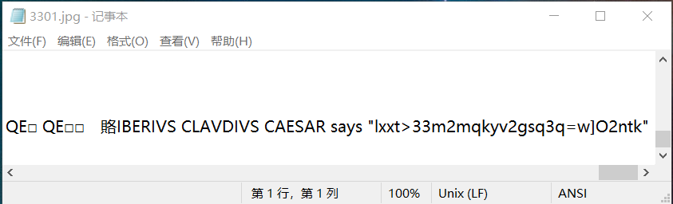
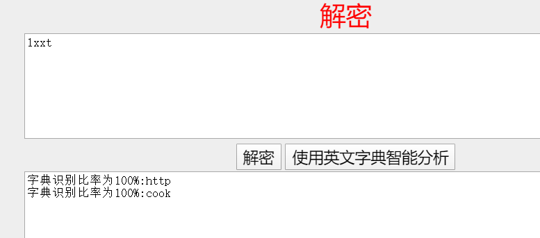
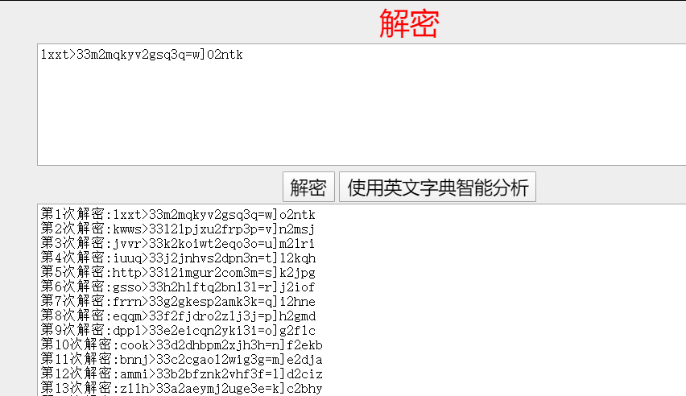
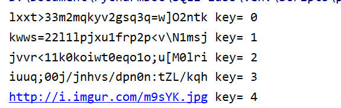

- ## 论坛贴图
图片如下：


file命令查看一下，是一个正常的图片文件
```shell
root@kali:~/Desktop# file 3301.jpg 

3301.jpg: JPEG image data, JFIF standard 1.01, aspect ratio, density 1x1, segment length 16, baseline, precision 8, 509x503, components 3
```

用binwalk查看也只是一个文件没有包含其他文件：

```shell
root@kali:~/Desktop# binwalk 3301.jpg 

DECIMAL       HEXADECIMAL     DESCRIPTION
--------------------------------------------------------------------------------
0             0x0             JPEG image data, JFIF standard 1.01

```


用记事本，winhex等打开只后全是乱码，但能在文件的末尾看到
打开如下:


```
CLAVDIVS CAESAR says "lxxt>33m2mqkyv2gsq3q=w]O2ntk"
```

似乎是凯撒密码，但是包含特殊字符，先截取前四个字母去分析一下：

应该是"http"没差了，字母后移四位，即==key=4==。全部解密后（特殊字符并未解密）：


```
http>33i2imgur2com3m=s]k2jpg
```

应该是一个网址，但还有特殊字符和数字没有解决
查阅[ASCII表](http://ascii.911cha.com/)：
|二进制|十进制|十六进制|字符|
|-|-|-|-|
|0010 1110|     46|     2E|     .|
|0010 1111| 	47| 	2F| 	/|
|0011 0000| 	48| 	30| 	0|
|0011 0001| 	49| 	31| 	1|
|0011 0010| 	50| 	32| 	2|
|0011 0011| 	51| 	33| 	3|
|0011 0100| 	52| 	34| 	4|
|0011 0101| 	53| 	35| 	5|
|0011 0110| 	54| 	36| 	6|
|0011 0111| 	55| 	37| 	7|
|0011 1000| 	56| 	38| 	8|
|0011 1001| 	57| 	39| 	9|
|0011 1010| 	58| 	3A| 	:|
|0011 1011| 	59| 	3B| 	;|
|0011 1100| 	60| 	3C| 	<|
|0011 1101| 	61| 	3D| 	=|
|0011 1110| 	62| 	3E| 	>|
|0011 1111| 	63| 	3F| 	?|

对特殊字符及数字进行解密后：



得到网址：[http://i.imgur.com/m9sYK.jpg](http://i.imgur.com/m9sYK.jpg)

- ## 又一张图
点击该链接后会的到另一张图片：


> WOOPS
> Just decoys this way.
> 
> Looks like you can't guess how to get the message out.

图片中提供了至少两条信息：
- decoy
我们可能被骗了，难道是寻找线索的方向不对？但根据之前的图片除了得到这个链接以外并未什么收获，这个地方暂且不管。
- guess out 
这两个词同时出现，会让人联想到一款图像隐写软件==outguess==
这是它的[官网](http://www.outguess.org/)，但是很难打开