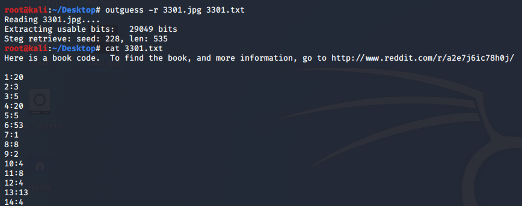

- ## 论坛贴图
图片如下：


file命令查看一下，是一个正常的图片文件
```shell
root@kali:~/Desktop# file 3301.jpg 

3301.jpg: JPEG image data, JFIF standard 1.01, aspect ratio, density 1x1, segment length 16, baseline, precision 8, 509x503, components 3
```

用binwalk查看也只是一个文件没有包含其他文件：

```shell
root@kali:~/Desktop# binwalk 3301.jpg 

DECIMAL       HEXADECIMAL     DESCRIPTION
--------------------------------------------------------------------------------
0             0x0             JPEG image data, JFIF standard 1.01

```


用记事本，winhex等打开只后全是乱码，但能在文件的末尾看到
打开如下:


```
CLAVDIVS CAESAR says "lxxt>33m2mqkyv2gsq3q=w]O2ntk"
```

似乎是凯撒密码，但是包含特殊字符，先截取前四个字母去分析一下：

应该是"http"没差了，字母后移四位，即==key=4==。全部解密后（特殊字符并未解密）：


```
http>33i2imgur2com3m=s]k2jpg
```

应该是一个网址，但还有特殊字符和数字没有解决
查阅[ASCII表](http://ascii.911cha.com/)：
|二进制|十进制|十六进制|字符|
|-|-|-|-|
|0010 1110|     46|     2E|     .|
|0010 1111| 	47| 	2F| 	/|
|0011 0000| 	48| 	30| 	0|
|0011 0001| 	49| 	31| 	1|
|0011 0010| 	50| 	32| 	2|
|0011 0011| 	51| 	33| 	3|
|0011 0100| 	52| 	34| 	4|
|0011 0101| 	53| 	35| 	5|
|0011 0110| 	54| 	36| 	6|
|0011 0111| 	55| 	37| 	7|
|0011 1000| 	56| 	38| 	8|
|0011 1001| 	57| 	39| 	9|
|0011 1010| 	58| 	3A| 	:|
|0011 1011| 	59| 	3B| 	;|
|0011 1100| 	60| 	3C| 	<|
|0011 1101| 	61| 	3D| 	=|
|0011 1110| 	62| 	3E| 	>|
|0011 1111| 	63| 	3F| 	?|

对特殊字符及数字进行解密后：


得到网址：[http://i.imgur.com/m9sYK.jpg](http://i.imgur.com/m9sYK.jpg)

- ## 又一张图
点击该链接后会的到另一张图片：


> WOOPS
> Just decoys this way.
> 
> Looks like you can't guess how to get the message out.

图片中提供了至少三条信息：
- decoy
我们可能被骗了，难道是寻找线索的方向不对？但根据之前的图片除了得到这个链接以外并未什么收获，这个地方暂且不管。
- guess out 
这两个词同时出现，会让人联想到一款图像隐写软件==outguess==。这是它的[官网](http://www.outguess.org/)，但是很难打开，可以到[https://github.com/crorvick/outguess](https://github.com/crorvick/outguess)去下载安装。
- 鸭子图片，~~线索or~~讽刺？暂且不理。

用outguess解密这个图片，却是报错：
```shell
root@kali:~/Desktop# outguess -r duck.jpg duck.txt
Reading duck.jpg....
Extracting usable bits:   39682 bits
Steg retrieve: seed: 16668, len: 51755
Extracted datalen is too long: 51755 > 4961

```
没有结果，难道需要密码？Have a try!很可惜，没结果！！！
```shell
root@kali:~/Desktop# outguess -k "duck" -r duck.jpg duck.txt 
Reading duck.jpg....
Extracting usable bits:   39682 bits
Steg retrieve: seed: 13775, len: 1954
root@kali:~/Desktop# cat duck.txt 
-���K5��%�I7E��B�M`�8F�iv�kbS���-a~��6d����-���b����kw���:�E~B���.nE�����/,��
��o�     g[▒�y䀰Sn�W�   i��?G��.�W��B���j��p�������iS▒�5o���� ��3kUR/�h���7�H瘱
    �*]��L8Qa:�.�mЕ<F��
                       ��zu�h�f�F�����V�|�<��cвn�C�}y-CoZ-��"���p���x(�{�#����h�u��^�b'�)v���`�7y2y��3���2�����ٴ
                                                                                                                b��2[` �"uQ��^��
�$�a���q��      ��R�����pJ&q
��8F����q@��>n{C����U��G��ϑC�N<�Fw�Ta����E���l{I�_�l��0��३�S�e�в]w咯��/f"ݲ�@�-VŎ�▒+�Ի�h����X�*�h}��D�J^��h��|��b�х�+�D▒��[I���r

 ���F�I>�ZAw�J��:�-��y�}�0�Sm����3 ��Rӕ�,�$�ށ$b{L�q�Aru�C�M���u^�WY.����v�����+Ǝh▒�
��c�I��K_^S��RT�
                ;.Z
�5K�w�9C="���N��p�\z�:�j�i�8���i�+�+�w���Ys�▒d�-Y�/:Az��B�B�e�����)ġ��t�ԣ<#���4d�}z�8~x�׾,�=�0N��F��9`�1g��]���?;�(����A�<���U�a���<�l��H�F��4��_���V6���qT׾��g��m�tz³B�P�Dx▒=3�v�[����l�8=�PmB�A�#^l�,R�V7(j��!�Q��Q��n��~�RTar$iQf��$�y?�Y�0�J%��Y��

Q�J76�7
       gb�r������H��ߩ��G�z����SBLi�����\3"�K��}Qx�2o�ѿ�x(w}&JyX!��b2&X\����\���n/��8A:�u�8�������g
Ŕ-nGp���L�C $\W0���)[EP�"
��/�'�;�ǖ���Mc���o��;��J��v���T�LzJ5���m���Ռ�;�tHM0�-��������3��.n� �"�XL�zU!*dy��/��l��DS�s�[�(���B|d�/�S���ٺ�,Ċhn�G9�e��yոq�.
0 �����Gu�Z�pZ�Ncac��� ��+ڦw�TF�C��г��b��~u�n�ID����~��Qe▒s9�mX���V��BT����E��x�!r�B�
%$��A|h�A���Ⲗ���q���Y����@S�f,ߡ����p��x��t7�QM��x`�wD���6�0�\�G?���V5�\�����^�����~(NQ�Eo'F<��+��d�|
                                                                                                    eZ�p��L��r_��SpⲀ`_5q�w*��iKZ�a▒
�4uS����Z}���B���c��}   A�3����
��½u��� �#��D�E!e1�Z▒�k ?����#���*i���C���IM�   ��}��J��c�&r3:&%��GrN����i^�Yҟ��Hs�x��V�D�8QF�|f����/�&�΢�▒V�y[S���j�����p����7�N�NБ��e��(q��F~$�-��a��root@kali:~/Desktop# 

```

重新理一下思路：会用到outguess，就会用到图片。现在手里只有两张图，于是试一下论坛的那张图：



嘿嘿，这次有[结果](./images/3301.txt)了。


